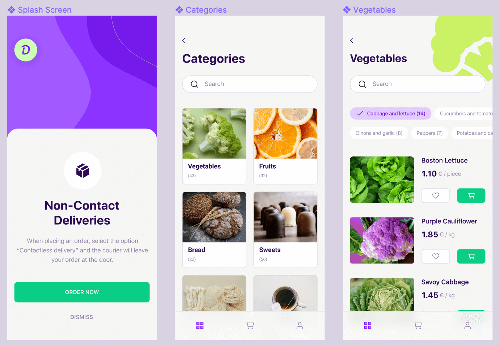

# M2W: Chili Lab's Food Delivery App

- **Website:** [Chili Labs](https://chililabs.io)
- **Mockup source:** [Figma](https://www.figma.com/file/kZz11aUFyYpXtsgInuJBb9/Delivery-App_UI-Kit-(Copy)?node-id=129%3A0)
- **From:** [FigmaResources](https://www.figmaresources.com/resources/figma-food-delivery-app-ui)

## Screenshot

## Description

This App UI design is for a fictitious food delivery company.

## Target

See if you can build it within the `webroot` folder :)

Good luck!
