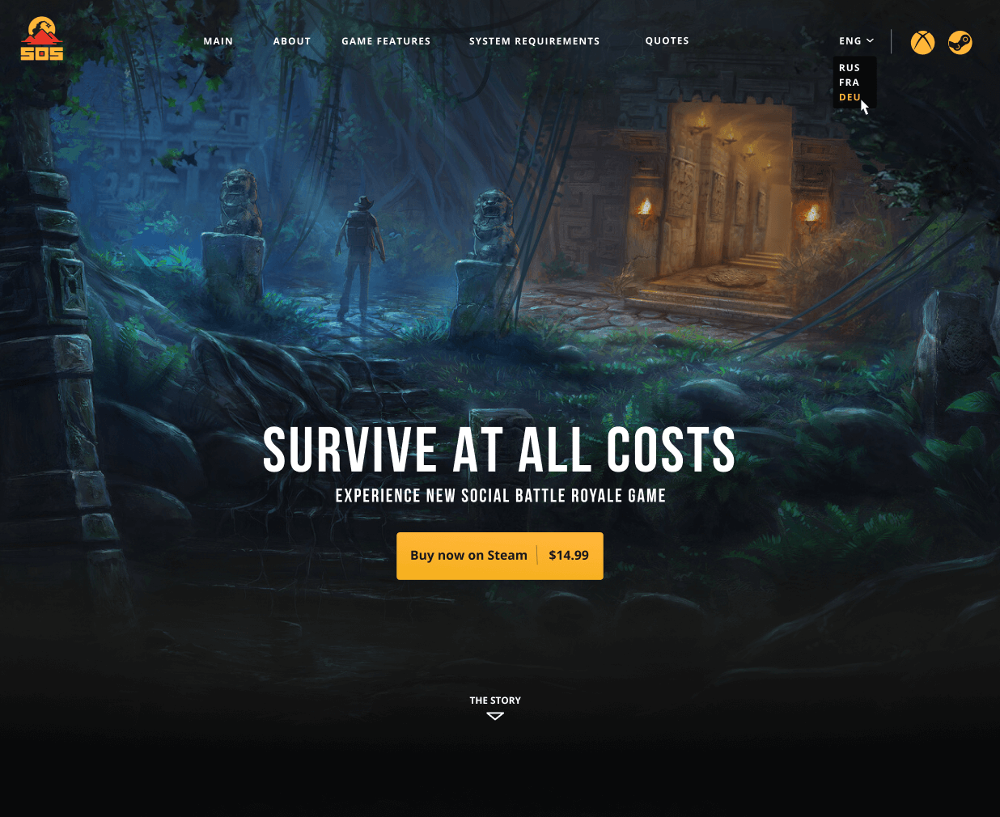

# M2W: Game landing page

- **From:** [ThemeUI](https://themeui.net/free-game-landing-page-for-figma/)
- **Mockup:** [Figma](https://www.figma.com/file/TQbxiZSrdlXzn5SWfhMoA9/Game-landing-page-Responsive)

## Screenshot

## Description

This responsive web UI design is for a fictitious and unnamed PC Game

## Target

See if you can build it within the `webroot` folder :)

Good luck!

## Additional artworks

This mockup includes extra artwork from:

- [Angelina Andreas](https://angelinaandreas.artstation.com/projects/N5RYK5)
- [Raul Osorio](https://www.artstation.com/artwork/e03yeJ)
