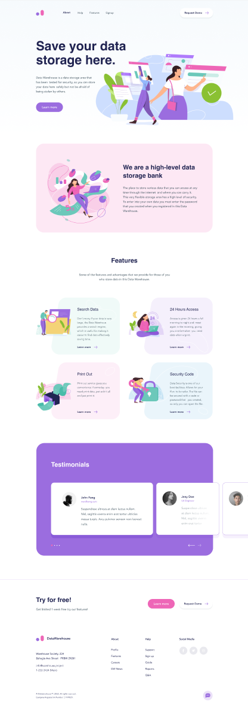

# M2W: Slab's Data-warehouse

- **Website:** [Slab Design](https://slabdsgn.com)
- **Mockup source:** [Figma](https://www.figma.com/file/kFKxGPwRKQ35u49Td3TqtC/SLAB-SHOT-Datawarehouse-Freebie-(Copy)?node-id=510%3A64)
- **From:** [FigmaResources](https://www.figmaresources.com/resources/figma-landing-page-template)

## Screenshot

## Description

This landing page design is for a fictitious data storage company. The illustrations mimic the aesthetic for the entire site: rounded vectors, playful colours and easy-on-the-eye.

## Target

This mockup could easily be the homepage. See if you can build it within the `webroot` folder :)

Good luck!
