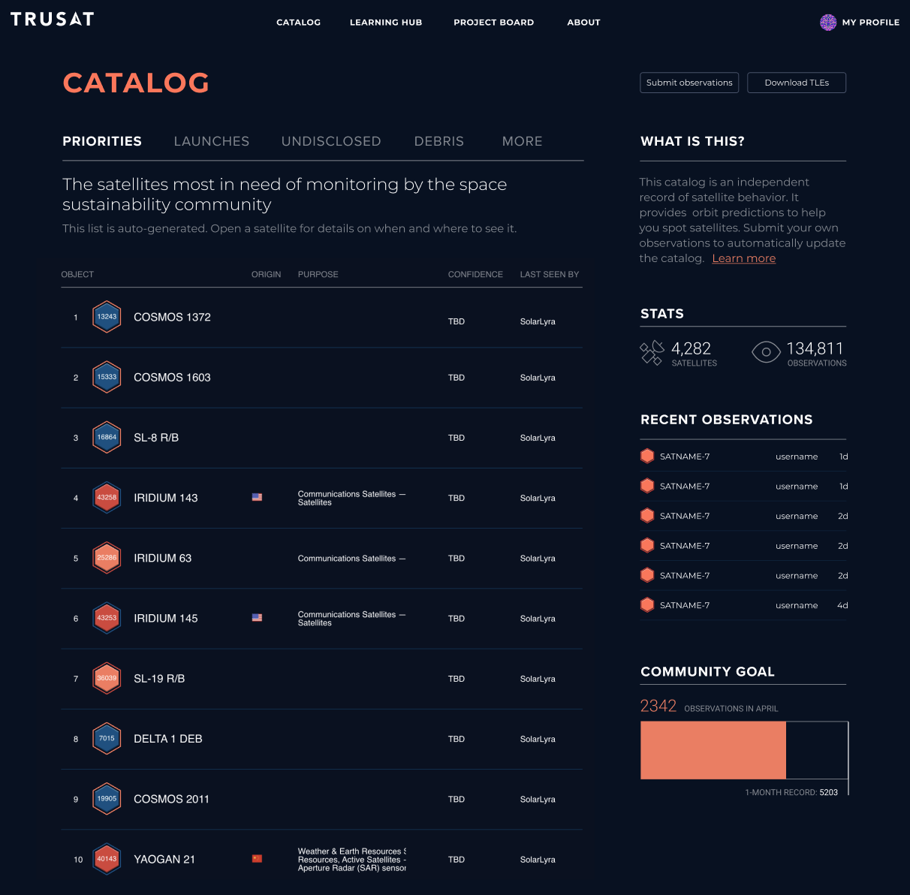

# M2W: TruSat.org

- **Website:** [TruSat.org](https://trusat.org)
- **Mockup source:** [Figma](https://www.figma.com/file/YcGbCgwSJ7vCjWPVYpgJRA/TruSat---Catalog-(Copy)?node-id=24%3A2)

## Screenshot

## Description

This stencil-like design features a dark-theme, perfect for night-time use while tracking satelites through the skies.

## Target

In the 'Activity (Refined)' section, there's a 'Catalog' page, which looks feature complete, let's use that as our chosen mockup.

Good luck!